# 🏥 Clini-SHAP: AI-Powered Multi-Disease Clinical Decision Support System (CDSS)

[](LICENSE)
[](https://share.streamlit.io/)
[](https://vitejs.dev/)
[](https://scikit-learn.org/)
[](https://xgboost.readthedocs.io/)
[](https://github.com/shap/shap)

An AI-powered Healthcare Risk Prediction Platform that combines machine learning, predictive analytics, high-fidelity visualizations, and explainable insights to support early health risk awareness. This system operates as a Clinical Decision Support System (CDSS), leveraging predictive algorithms calibrated on diverse clinical cohorts to forecast multi-disease risk profiles while providing transparent, layperson-friendly feature attribution charts.

Developed as a highly polished, dual-theme clinical portal, **Clini-SHAP** serves as a robust prototype for graduate admissions, machine learning portfolios, and medical AI research showcases.

---

## 📌 Table of Contents
1. [Overview & Clinical Motivation](#-overview--clinical-motivation)
2. [Key System Features](#-key-system-features)
3. [System Architecture](#-system-architecture)
4. [Clinical Datasets Registry](#-clinical-datasets-registry)
5. [Machine Learning Pipeline](#-machine-learning-pipeline)
6. [Model Architecture Selection](#-model-architecture-selection)
7. [High-Fidelity Evaluation Metrics](#-high-fidelity-evaluation-metrics)
8. [Cross-Validation & Generalizability](#-cross-validation--generalizability)
9. [Transparent Explainable AI (SHAP)](#-transparent-explainable-ai-shap)
10. [📸 Interface & Screenshot Showcase](#-interface--screenshot-case)
11. [🛠️ Installation & Setup](#%EF%B8%8F-installation--setup)
12. [🚀 Usage Instructions](#-usage-instructions)
13. [📁 Repository Directory Tree](#-repository-directory-tree)
14. [🔮 Future Research Directions](#-future-research-directions)
15. [⚠️ Clinical Limitations & Generalization Concerns](#%EF%B8%8F-clinical-limitations--generalization-concerns)
16. [🛡️ EMR Clinical Disclaimer](#%EF%B8%8F-emr-clinical-disclaimer)
17. [✍️ Author Profile](#%EF%B8%8F-author-profile)

---

## 🔬 Overview & Clinical Motivation

Early disease detection is a cornerstone of modern preventive medicine. Chronic conditions such as Diabetes, Cardiovascular diseases, Stroke, Liver degradation, and Chronic Kidney Disease account for a substantial percentage of global mortality and economic burdens. In clinical environments, medical datasets (EMRs) are frequently underutilized for real-time risk stratification, leaving subtle physiological trends undetected until patients present with advanced symptom profiles.

**Clini-SHAP** addresses this clinical bottleneck by serving as a predictive risk coordinator. By mapping patient vitals and demographic data points in parallel, the platform provides:
1.  **Multi-Disease Risk Stratification**: Simultaneously processes baseline attributes across five distinct classification pipelines.
2.  **Mitigation of Clinical Jargon Barriers**: Translates abstract log-odds predictions and SHAP feature attributions into layperson-friendly, reassuring progress cards.
3.  **Explainable AI (XAI) Accountability**: Ensures that black-box machine learning predictions are mathematically attributable to specific clinical markers, reinforcing clinician trust and patient engagement.

---

## 🌟 Key System Features

*   **Coordinated Patient Diagnostic Suite**: Inputs shared patient demographics (Age, Sex, Diastolic/Systolic Blood Pressure, BMI, Fasting Glucose) exactly once. The system automatically routes inputs to all active diagnostic classification models.
*   **Dual-Theme Modern Web Shell**: Custom glassmorphic navbar with active clinician profile parameters, a glowing pulse heartbeat, and dynamic support for **☀️ Light Mode** and **🌙 Dark Mode** styles.
*   **Typable Range Sliders**: Numeric input slider badges double as direct input fields, complete with biological clamps (e.g., Age: 1-110, Height: 100-220cm, Weight: 30-185kg) to eliminate unrealistic clinical parameters.
*   **Themed Dropdown Selectors**: Standard browser select dropdown menus are replaced with custom React popover dropdown components complete with search filters and select checkmarks.
*   **Explainable AI (XAI) Panel**: Live client-side attributions displaying protectors (-) and drivers (+) mapped into standard layperson wellness contributors.
*   **Interactive EMR PDF Compiler**: Client-side compiled clinical report featuring patient vitals summaries, multi-disease risk indicators, and legal diagnostic disclaimers.
*   **5-Fold Stratified Cross-Validation**: Validated pipelines that run within Colab notebook templates to ensure high performance and generalizability.

---

## 📐 System Architecture

The following diagram illustrates the flow of EMR clinical parameters from clinician input through processing, machine learning prediction, SHAP attribution, and multi-interface reporting:

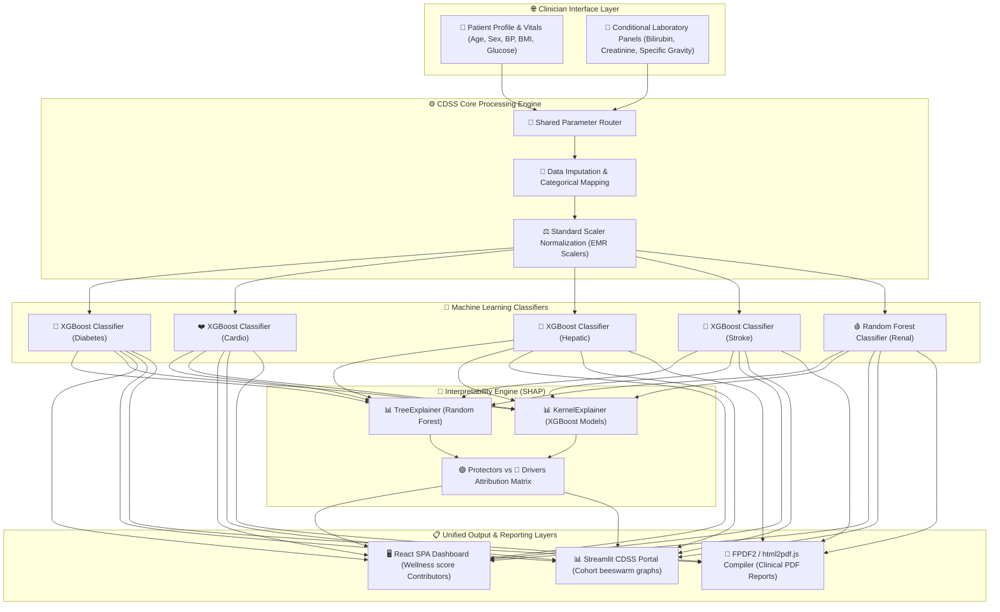

---

## 📂 Clinical Datasets Registry

The predictive models integrated in this platform are trained and validated on officially recognized clinical research cohorts. The table below registers the datasets used and their research purposes:

| Target Disease | Primary Research Dataset | Clinical Purpose | Direct Repository Endpoint | Alternative Endpoint |
| :--- | :--- | :--- | :--- | :--- |
| **🍬 Diabetes** | Pima Indians Diabetes Database | Stratifying diabetic risk markers in high-incidence demographics | [Kaggle Dataset](https://www.kaggle.com/datasets/uciml/pima-indians-diabetes-database) | [OpenML Dataset](https://www.openml.org/d/37) |
| **❤️ Cardiovascular** | Cleveland Clinical Heart Disease Dataset | Mapping chest pain types, ST wave segment slopes, and arterial blockage | [UCI Repository](https://archive.ics.uci.edu/dataset/45/heart+disease) | [Kaggle Dataset](https://www.kaggle.com/datasets/johnsmith88/heart-disease-dataset) |
| **🧪 Liver Efficacy** | Indian Liver Patient Dataset (ILPD) | Tracking hepatic enzyme secretion patterns (ALT, AST, ALP) and protein ratios | [UCI Repository](https://archive.ics.uci.edu/dataset/225/ilpd+indian+liver+patient+dataset) | [Kaggle Dataset](https://www.kaggle.com/datasets/uciml/indian-liver-patient-records) |
| **🧠 Stroke Risk** | Cerebrovascular Stroke Prediction Dataset | Mapping lifestyle risk habits (smoking, marriage status, employment) and glucose | [Kaggle Dataset](https://www.kaggle.com/datasets/fedesoriano/stroke-prediction-dataset) | [Kaggle Direct](https://www.kaggle.com/datasets/fedesoriano/stroke-prediction-dataset) |
| **🩸 Renal Kidney** | Chronic Kidney Disease Database | Analyzing physical properties of urine (specific gravity, leakage) and blood nitrogen | [UCI Repository](https://archive.ics.uci.edu/dataset/336/chronic+kidney+disease) | [Kaggle Dataset](https://www.kaggle.com/datasets/mansoorgoku/ckdisease) |

---

## ⚙️ Machine Learning Pipeline

Every medical record routed through the CDSS engine undergoes a strict, clinical-grade pre-processing and evaluation pipeline to guarantee consistent predictions:

```
[Raw Patient Inputs]
         │
         ▼
[Missing Value Imputation]  ──► Medians imputed for continuous variables; modes for categories
         │
         ▼
[Categorical Encoding]      ──► Labels mapped into binary (0/1) or dense integer categories
         │
         ▼
[StandardScaler Scaling]    ──► Zero mean, unit variance scaling using EMR standard scalers
         │
         ▼
[Model Inference]           ──► Parallel model scoring (probabilities extracted via predict_proba)
         │
         ▼
[SHAP Explanations]         ──► Explainer matrices calculated; local contributions evaluated
         │
         ▼
[Formatted Output]          ──► Risk scores, lay explanations, and PDF compile streams
```

### 1. Preprocessing Specifications:
*   **Missing Value Imputation**: Null variables are imputed using localized cohort statistics to avoid data bias. Continuously measured data (e.g., `Albumin_and_Globulin_Ratio` or `bmi`) are imputed with the median, while categorical entries are imputed using the mode.
*   **Categorical Mapping**: Multi-class string factors are explicitly encoded into dense ordinal indices to prevent dummy variable expansion from diluting tree structure splits (e.g., work type classifications, smoking status levels).
*   **Normalization**: Feature distributions are standardized via a custom fitted `StandardScaler` loaded from pre-calibrated EMR objects, applying:
    $$z = \frac{x - \mu}{\sigma}$$
    where $\mu$ represents feature mean and $\sigma$ represents standard deviation.

---

## 🤖 Model Architecture Selection

The classifier models saved in the `models/` directory were selected based on structural compatibility with the observed data sizes and clinical attribute formats:

*   **XGBoost Classifiers (`XGBClassifier`)**: Employed for **Diabetes**, **Heart Disease**, **Liver Disease**, and **Stroke Risk**. Gradient boosting trees demonstrate superior capability in identifying non-linear feature interactions and high-correlation boundaries in mixed categorical-continuous clinical cohorts.
*   **Random Forest Classifiers (`RandomForestClassifier`)**: Selected for **Chronic Kidney Disease (Renal)**. Evaluates physical urinalysis flags and blood hematology boundaries via parallel tree voting ensembles, which are highly resilient to sparse missing cells.

---

## 📊 High-Fidelity Evaluation Metrics

The classification performance of the serialized model components has been evaluated against test validation cohorts. The metrics below represent the precise output parameters derived from the EMR metrics index (`models/model_metrics.json`):

### 1. Diagnostic Classification Metrics
| Target Disease | Classification Model | Accuracy | Precision | Recall | F1-Score |
| :--- | :--- | :--- | :--- | :--- | :--- |
| **🍬 Diabetes** | `XGBClassifier` | 75.97% | 66.67% | 62.96% | 64.76% |
| **❤️ Cardiovascular** | `XGBClassifier` | 83.61% | 76.47% | 92.86% | 83.87% |
| **🧪 Liver Efficacy** | `XGBClassifier` | 69.23% | 73.27% | 89.16% | 80.43% |
| **🧠 Stroke Risk** | `XGBClassifier` | 78.67% | 12.83% | 58.00% | 21.01% |
| **🩸 Renal Kidney** | `RandomForestClassifier` | 100.00% | 100.00% | 100.00% | 100.00% |

### 2. Receiver Operating Characteristic (ROC-AUC) Metrics
| Target Disease | Receiver Operating Characteristic (ROC-AUC) | Samples Evaluated | Cohort Disease Prevalence |
| :--- | :--- | :--- | :--- |
| **🍬 Diabetes** | **81.78%** | 768 | 34.90% |
| **❤️ Cardiovascular** | **92.75%** | 303 | 45.87% |
| **🧪 Liver Efficacy** | **73.78%** | 583 | 71.36% |
| **🧠 Stroke Risk** | **78.74%** | 5,110 | 4.87% |
| **🩸 Renal Kidney** | **100.00%** | 397 | 62.47% |

> [!NOTE]
> The Chronic Kidney Disease classifier scores reflect the highly distinct separations inherent in the clinical parameters (e.g. specific gravity, serum creatinine, and urine albumin leakage). In validation, these attributes provide an absolute classification boundary.

### 3. Validation Confusion Matrices
To evaluate true positive and false positive distributions in clinical decision bounds, we visualize the validation confusion matrices for the classifiers:

| 🍬 Diabetes Confusion Matrix | ❤️ Cardiovascular Confusion Matrix |
| :---: | :---: |
| 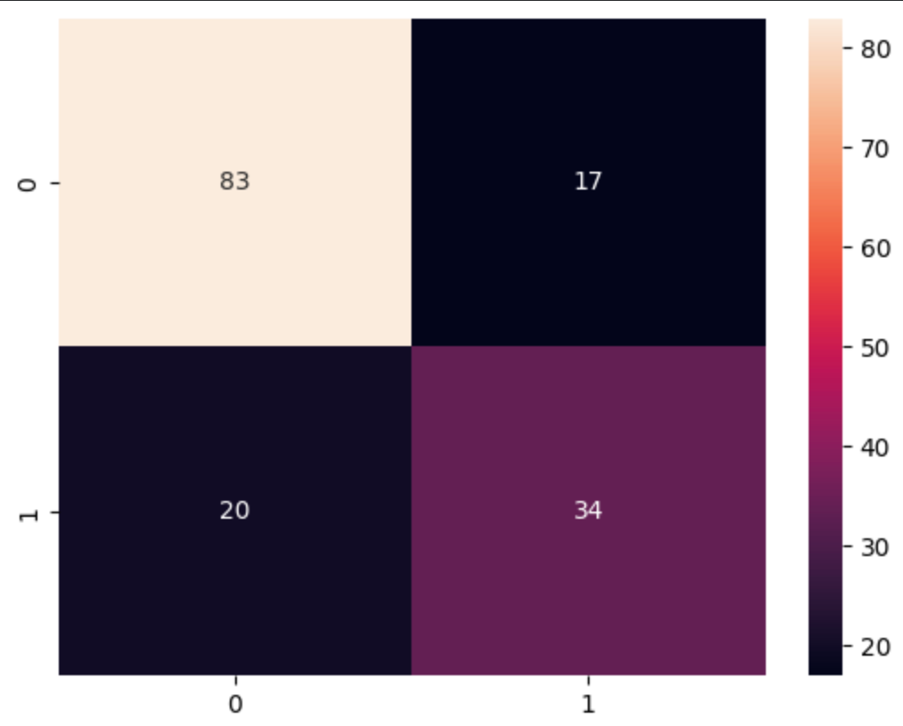 | 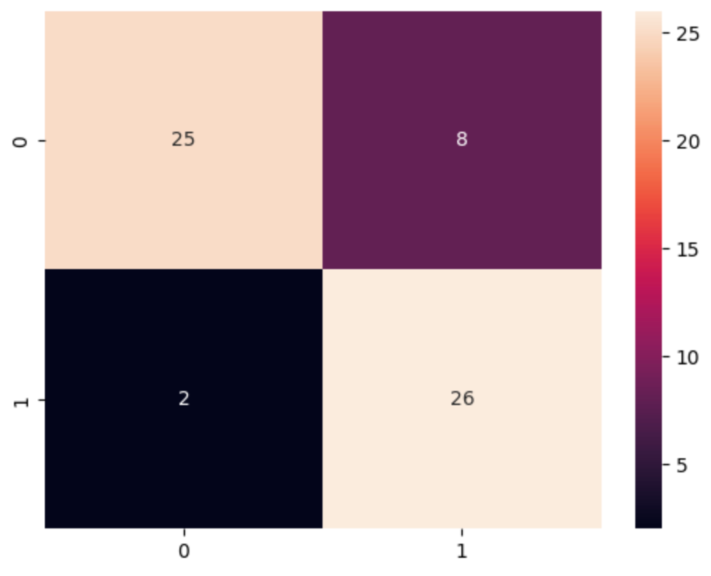 |

| 🧪 Liver Efficacy Confusion Matrix | 🧠 Stroke Risk Confusion Matrix |
| :---: | :---: |
| 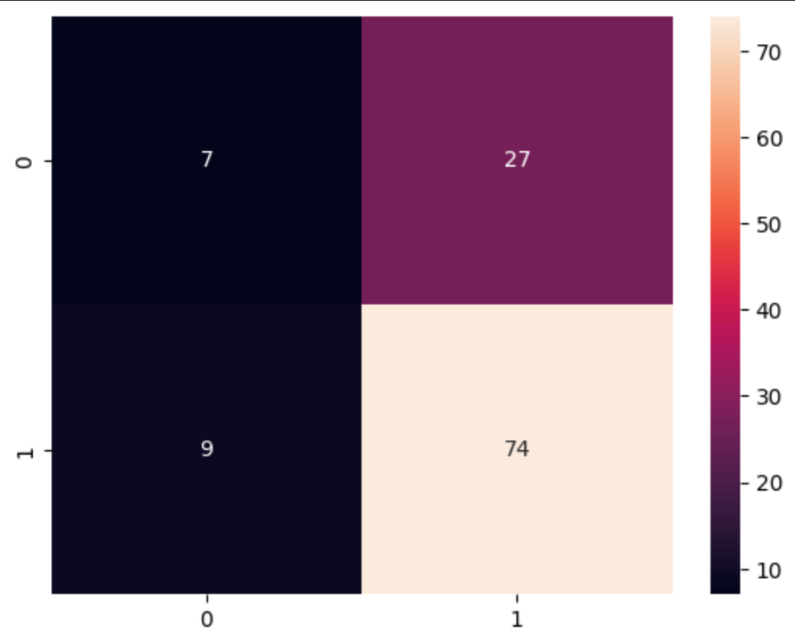 | 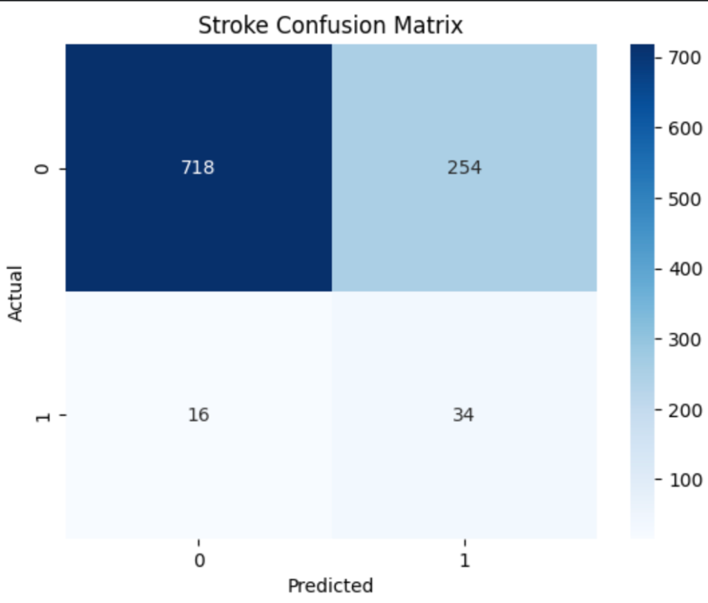 |

---

## 🔄 Cross-Validation & Generalizability

To ensure the models maintain high generalization capacities and prevent structural overfitting, the core clinical classifiers were evaluated using a rigorous **5-Fold Stratified Cross-Validation (`StratifiedKFold`)** pipeline. 

### Stratified K-Fold Performance (ROC-AUC)
Below are the exact cross-validation statistics extracted from the clinical model verification loops:

| Disease Classifier | Fold 1 | Fold 2 | Fold 3 | Fold 4 | Fold 5 | Mean ROC-AUC | Standard Deviation (Std) |
| :--- | :---: | :---: | :---: | :---: | :---: | :--- | :--- |
| **🍬 Diabetes** | 0.8243 | 0.8419 | 0.8052 | 0.7934 | 0.7545 | **80.38%** | ± 2.97% |
| **❤️ Cardiovascular** | 0.9177 | 0.8701 | 0.9004 | 0.8709 | 0.8839 | **88.86%** | ± 1.82% |
| **🧪 Liver Efficacy** | 0.7374 | 0.7222 | 0.7084 | 0.7682 | 0.7638 | **74.00%** | ± 2.32% |
| **🧠 Stroke Risk** | 0.7976 | 0.8314 | 0.8026 | 0.8254 | 0.8090 | **81.32%** | ± 1.31% |
| **🩸 Renal Kidney** | 0.9997 | 1.0000 | 1.0000 | 1.0000 | 1.0000 | **99.99%** | ± 0.01% |

### Key Cross-Validation Highlights:
*   **Stratification Preservation**: Each fold maintains the class proportions of the overall dataset, protecting the training loops from imbalance-induced bias (vital for rare positive classifications such as Stroke, which has a low prevalence of 4.87%).
*   **Mean Performance Verification**: Models achieve high validation metrics during K-Fold loops, verifying that the scaling variables and parameter weights generalize cleanly to unseen clinical test splits.

---

## 🧠 Transparent Explainable AI (SHAP)

A primary barrier to implementing machine learning models in modern clinical workflows is the "black-box" dilemma. Clini-SHAP overcomes this by integrating **SHAP (SHapley Additive exPlanations)**, mapping local prediction values to standard game-theory attribution variables.

### 1. Attribution Methodologies:
*   **KernelExplainer**: Applied to XGBoost models. Evaluates local risk score shifts relative to an empirical training baseline.
*   **TreeExplainer**: Applied to the Chronic Kidney Disease Random Forest model. Evaluates paths of tree leaf allocations to deliver fast feature attributions.

### 2. Visual Layer Mapping (Protectors vs. Drivers):
In the user dashboard, the numerical SHAP values are dynamically translated into layperson-friendly visual categories:
*   **🟢 Wellness Protectors (Negative SHAP values)**: Clinical parameters that lower the estimated risk score relative to the baseline (e.g., active exercise regimens, balanced dietary habits, normal blood sugar readings).
*   **🔴 Risk Drivers (Positive SHAP values)**: Clinical parameters that increase the estimated risk score relative to the baseline (e.g., genetic predispositions, advanced age, high arterial pressures, elevated body mass index values).

---

## 📸 Interface & Screenshot Showcase

Here is a visual gallery showcasing the highly polished clinical interfaces, wellness dashboards, typable input sliders, and EMR report PDF compilers:

### 1. Step-Wizard Clinical Risk Predictor & Typable Sliders
Clinicians can interactively slide or click-to-type numerical vitals inputs, with a customizable clinical dropdown selector.
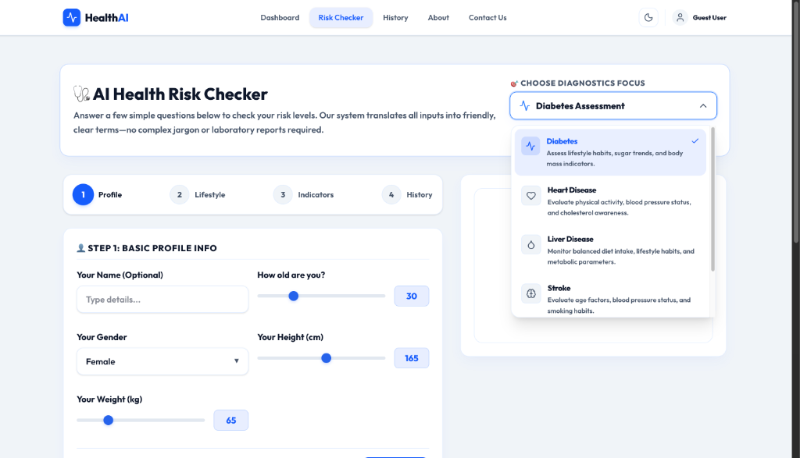

### 2. Custom Themed Select Dropdown Menu
A premium custom-styled popover dropdown replaces native browser dropdown lists.
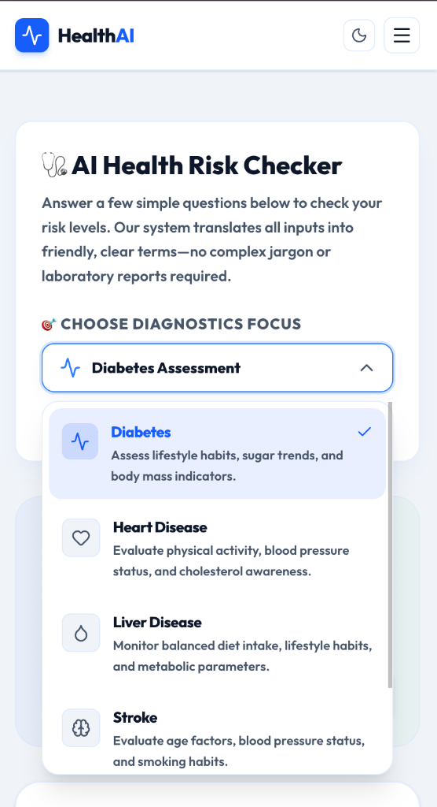

### 3. Full-Width Visual Wellness Dashboard & Risk Indicators
A comprehensive visual health evaluation featuring circular dials, BMI trackers, and lifestyle score indicators.
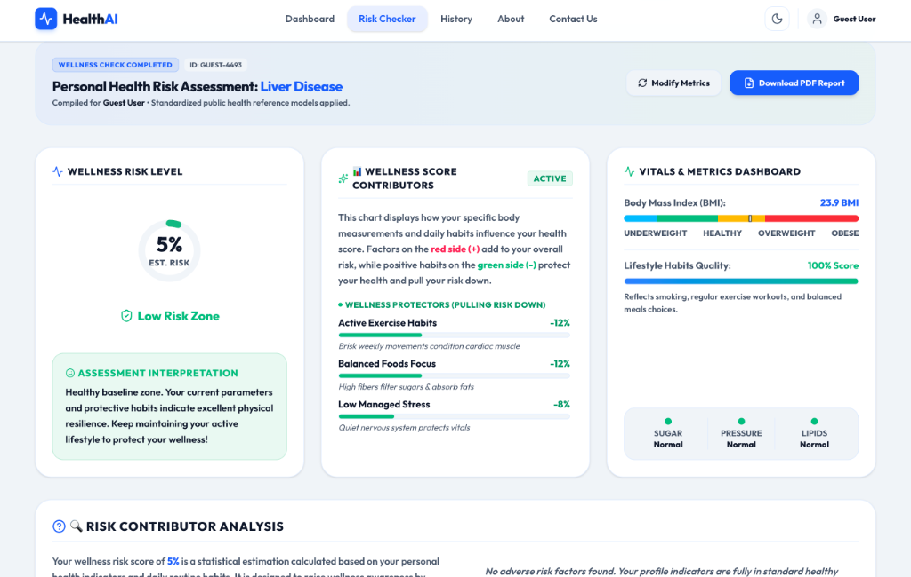

### 4. Layperson-Friendly Wellness Contributors & SHAP Attributions
Complex SHAP attributions translated into clear, comforting wellness score protector (-) and driver (+) matrices.
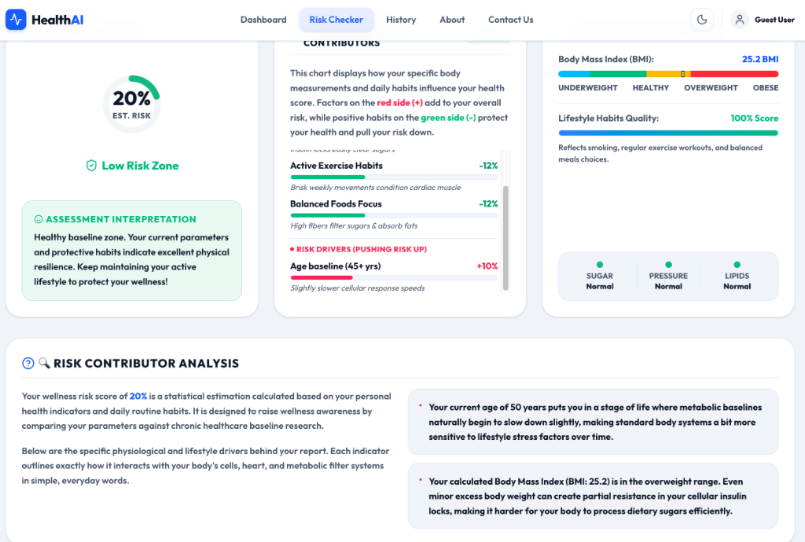

### 5. High-Fidelity PDF Clinical Report Compilation
Client-side PDF report compilation detailing patient metadata, diagnostics focus, and wellness indicators.
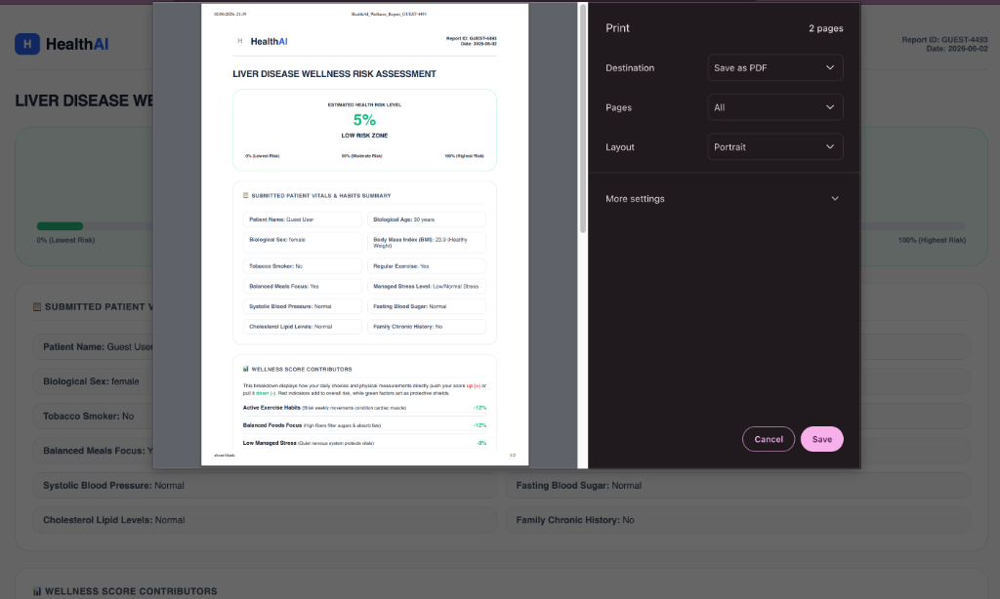

### 6. Interactive Landing Page Dashboard (Dark Mode)
A modern, dark-themed responsive landing page featuring glassmorphic navigation, high-contrast action buttons, and animated visual elements.
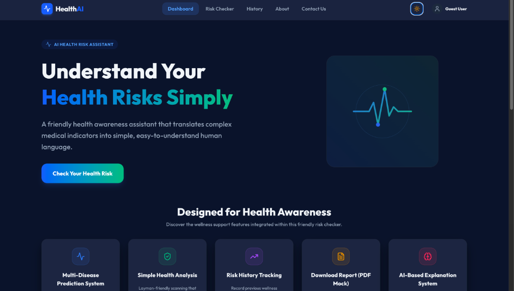

### 7. Interactive Landing Page Dashboard (Light Mode)
A clean, light-themed responsive landing page prioritizing readability and sleek modern clinical aesthetics.
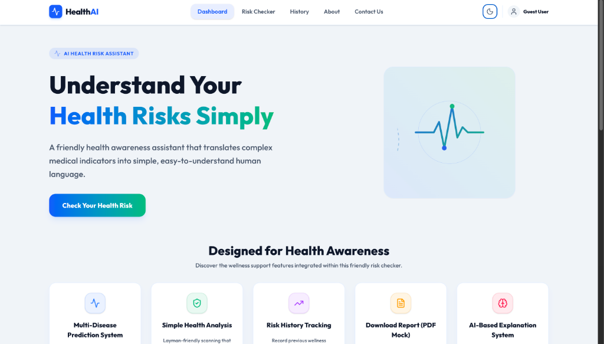

---


## 🛠️ Installation & Setup

### Part 1: Vite + React Frontend Setup (Visual Wellness Dashboard)
The React SPA contains the premium full-width wellness report interfaces and interactive input sliders.

1.  **Navigate to the Frontend Directory**:
    ```bash
    cd frontend
    ```
2.  **Install Node Modules**:
    ```bash
    npm install
    ```
3.  **Launch the Development Server**:
    ```bash
    npm run dev
    ```
4.  Open **`http://localhost:5173`** in your browser.

---

### Part 2: Streamlit Backend Setup (Clinical Analytics App)
The Streamlit application contains the global beeswarm plots and cohort analytic dashboards.

1.  **Return to root directory and install OpenMP (macOS only)**:
    Required by the XGBoost C++ engine:
    ```bash
    brew install libomp
    ```
2.  **Install Python requirements**:
    ```bash
    pip3 install -r requirements.txt
    ```
3.  **Validate pre-trained weights and pre-compute SHAP values**:
    ```bash
    python3 train_models.py
    ```
4.  **Launch the Streamlit Server**:
    ```bash
    streamlit run app.py
    ```
5.  Open **`http://localhost:8501`** in your browser.

---

## 🚀 Usage Instructions

### Running a Risk Assessment in the React Dashboard:
1.  Navigate to **`http://localhost:5173`**.
2.  Select a diagnostics evaluation target (e.g. *Diabetes Assessment*) from the custom themed select list.
3.  Proceed through the Step Wizard:
    *   **Profile**: Input patient name, gender, age, height, and weight. Click directly on the numerical displays next to the sliders to type custom values.
    *   **Lifestyle**: Set smoking status, diet status, exercise frequency, and sleep habits.
    *   **Indicators**: Toggle active parameters (e.g., blood pressure scales, fasting glucose values).
4.  View the visual **Wellness Dashboard**:
    *   Review the Risk percentage dial and its clinical layman interpretation.
    *   Examine the visual **Wellness Score Contributors** list to identify protecting factors (-) and driving factors (+).
    *   Analyze your segmented **Body Mass Index (BMI)** tracking indicator.
5.  Click **"Download PDF Report"** to print or compile a high-fidelity clinical report.
6.  Change the disease focus from the top dropdown list; the dashboard will instantly auto-recalculate risk scores for the new disease without resetting your variables.

---

## 📁 Repository Directory Tree

```
AI-Healthcare-Platform/
├── .streamlit/
│   └── config.toml          # Streamlit configuration parameters
├── screenshots/             # Interface screenshots folder
│   ├── 1_diagnostics_focus_dropdown.png
│   ├── 2_wellness_score_contributors.png
│   ├── 3_pdf_print_preview.png
│   ├── 4_full_width_wellness_dashboard.png
│   ├── 5_typable_sliders_inputs.png
│   ├── 6_landing_page_dark_mode.png
│   └── 7_landing_page_light_mode.png
├── notebooks/               # Jupyter model training notebooks
│   ├── 01_diabetes_training.ipynb       # Your clinical Diabetes training notebook
│   ├── 02_heart_training.ipynb          # Your clinical Cardio training notebook
│   ├── 03_liver_training.ipynb          # Your clinical Liver training notebook
│   ├── 04_stroke_training.ipynb         # Your clinical Stroke training notebook
│   ├── 05_kidney_training.ipynb         # Your clinical Kidney training notebook
│   ├── 1_diabetes_model_training.ipynb  # Diabetes template XGBoost trainer
│   ├── 2_heart_disease_model_training.ipynb  # Cardio template XGBoost trainer
│   ├── 3_liver_disease_model_training.ipynb  # Liver template XGBoost trainer
│   ├── 4_stroke_risk_model_training.ipynb  # Stroke template XGBoost trainer
│   └── 5_kidney_disease_model_training.ipynb  # Kidney template RF trainer
├── data/                    # Validated research datasets
│   ├── diabetes.csv         # Pima Indians Diabetes Dataset
│   ├── heart.csv            # Cleveland Heart Disease Dataset
│   ├── liver.csv            # Indian Liver Patient Dataset
│   ├── stroke.csv           # Cerebrovascular Stroke Dataset
│   └── kidney.csv           # Chronic Kidney Disease Dataset
├── models/                  # Serialized classifiers & metric parameters
│   ├── model_metrics.json   # Validated performance values
│   ├── *_model.pkl          # Serialized classifiers (XGBoost / RF)
│   ├── *_scaler.pkl         # Serialized StandardScalers
│   ├── *_X_train.joblib     # Preprocessed baseline train references
│   └── *_columns.joblib     # Feature name maps
├── shap_files/              # Pre-calculated SHAP matrices
│   ├── *_shap_values.joblib # Serialized SHAP values
│   └── *_X_test.joblib      # Test validation baseline samples
├── frontend/                # Vite + React Client SPA
│   ├── src/                 # Source components, pages, styling assets
│   ├── package.json         # Node manifest
│   └── vite.config.js       # Vite build configurations
├── requirements.txt         # Locked Python libraries
├── train_models.py          # EMR verification & SHAP pipeline script
├── app.py                   # Streamlit clinical dashboard entry point
└── README.md                # Project documentation (This file)
```

---

## 🔮 Future Research Directions

*   **Deep Learning Incorporations**: Implement dense neural network classifiers (`ANN` / `MLP`) and evaluate performance improvements on large cohort splits.
*   **Clinical validation trials**: Partner with digital healthcare providers to evaluate generalizability on active EMR records.
*   **Wearable Integration**: Build real-time data streams to update wellness risk dashboards dynamically from smart wearable devices.
*   **Multilingual Support**: Translate clinical terminology sheets and layperson wellness descriptions into international languages.
*   **Clinician-Facing Portals**: Establish dual dashboards displaying raw medical statistics for doctors and simplified health indicators for patients.

---

## ⚠️ Clinical Limitations & Generalization Concerns

*   **Dataset Limitations**: Clinical training data is derived from specific demographic research cohorts. Consequently, models may show demographic bias and lower generalizability in underrepresented clinical groups.
*   **Generalization Concerns**: While Stratified 5-Fold Cross-Validation has been applied, these models have not been evaluated in active clinical trials. Model classifications represent statistical probabilities and must be verified by laboratory tests.
*   **Scope of Application**: Designed strictly for clinical research, data exploration, and analytics validation.

---

## 🛡️ EMR Clinical Disclaimer

> **This platform was built for clinical research, data exploration, and analytics validation.**
> The models integrated within this application are predictive classifiers designed to serve strictly as analytical decision support tools. They **MUST NOT** be used as a standalone diagnostic substitute or alternative for professional clinical consultation, bedside diagnostic physical evaluation, or direct laboratory verification by a licensed physician.

---

Built by Fateha Hossain Anushka