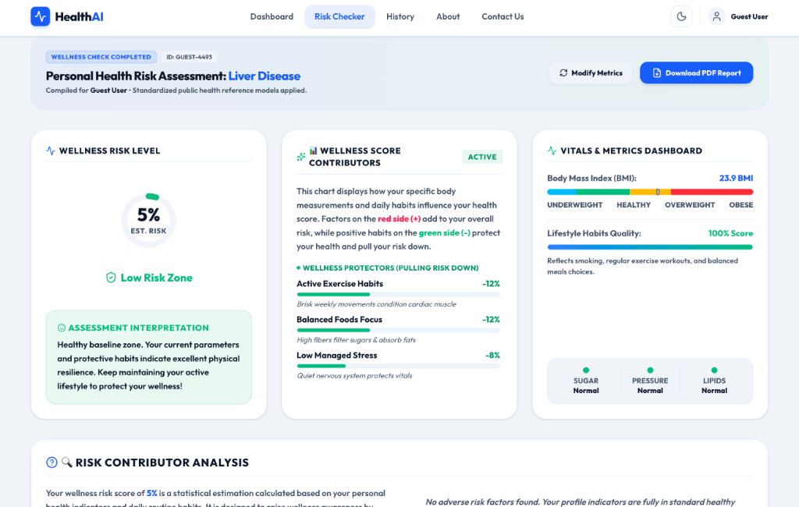
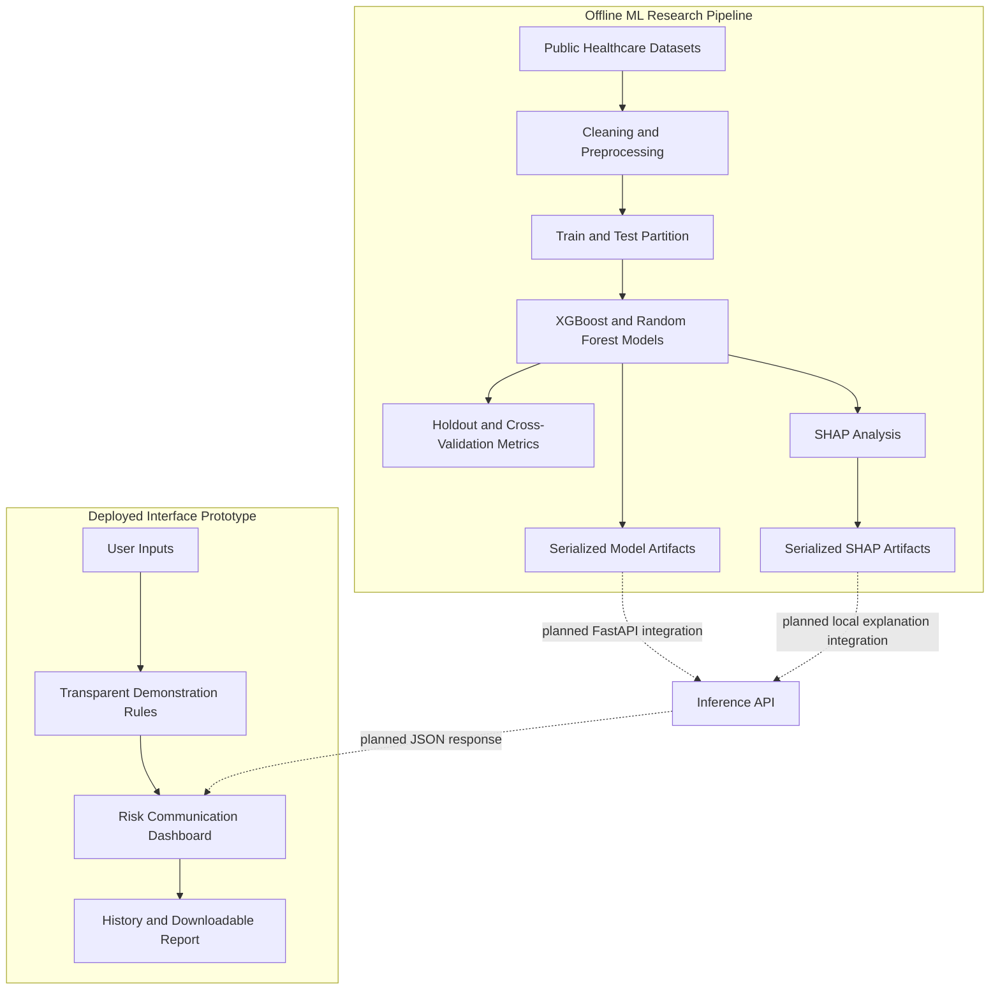
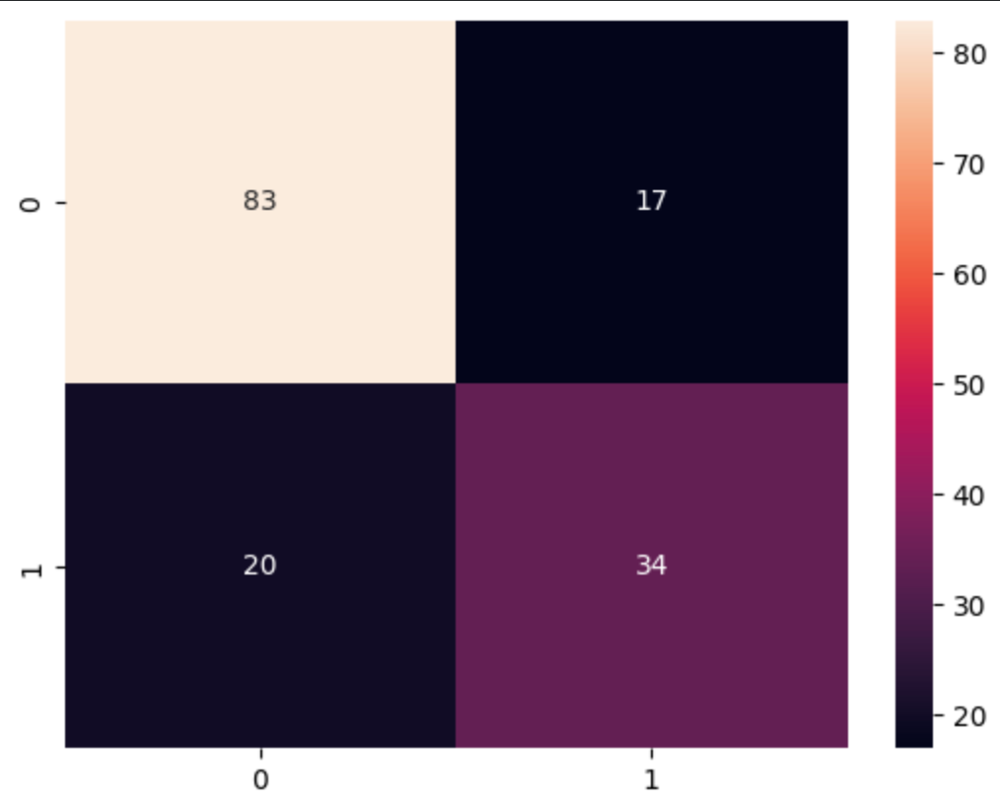
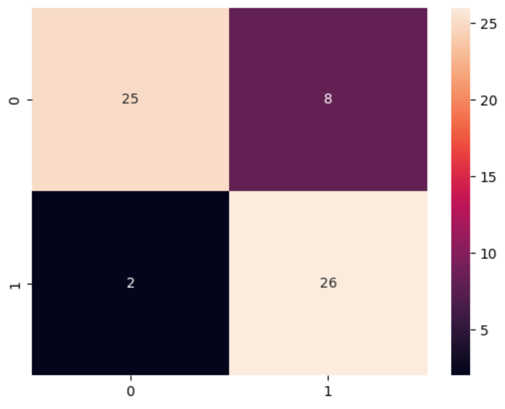
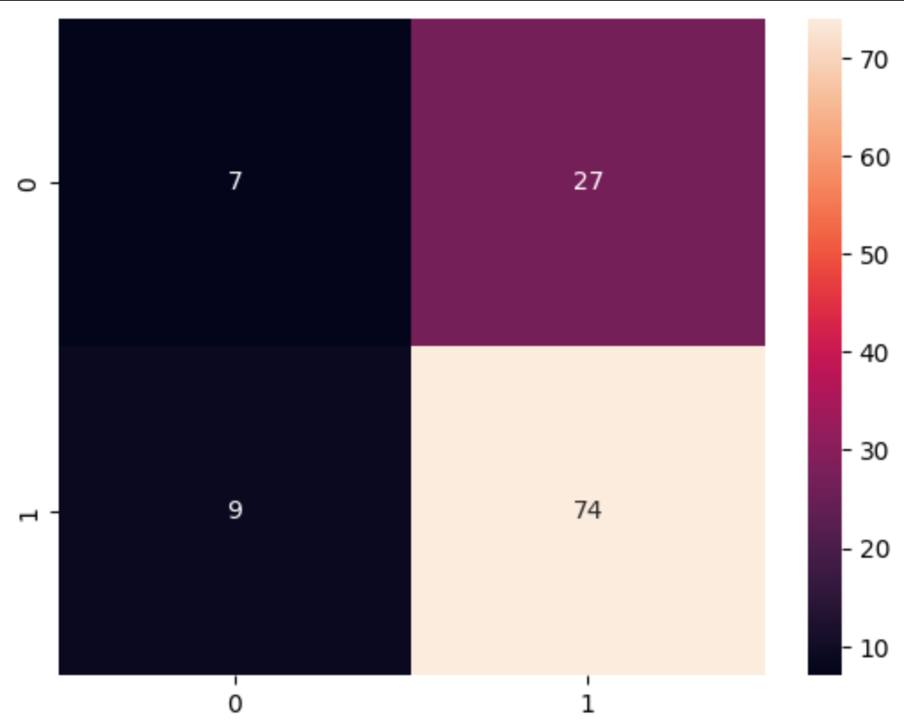
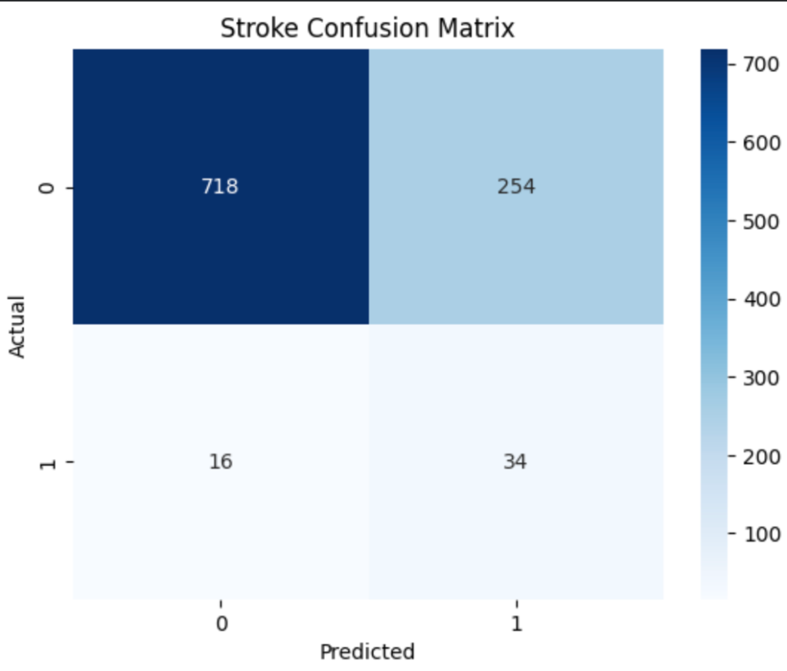
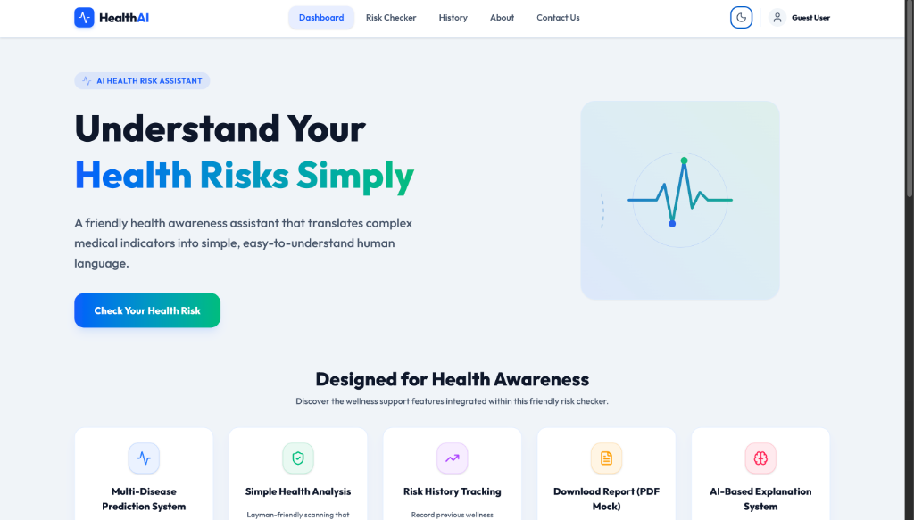
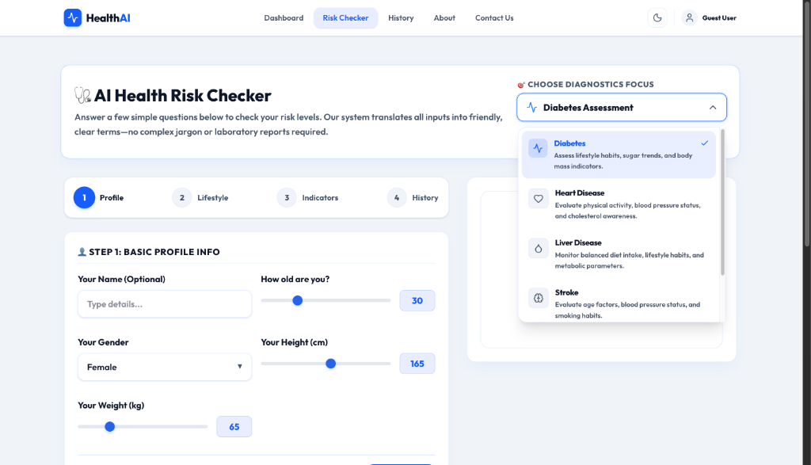
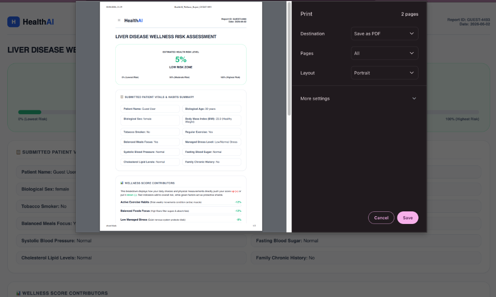

# Clini-SHAP: Explainable Healthcare Risk Analytics

> A research-oriented collection of multi-disease machine-learning experiments with an interactive health-risk communication prototype.

[](https://react.dev/)
[](https://vite.dev/)
[](https://scikit-learn.org/)
[](https://xgboost.readthedocs.io/)
[](https://shap.readthedocs.io/)
[](https://ai-healthcare-analytics-platform-jt.vercel.app/)



## Overview

Clini-SHAP explores interpretable machine learning for five public healthcare classification datasets:

- diabetes;
- heart disease;
- liver disease;
- stroke; and
- chronic kidney disease.

The repository contains two distinct components:

1. **Offline machine-learning experiments** implemented in Jupyter notebooks, including preprocessing, model training, holdout evaluation, cross-validation, and SHAP analysis.
2. **A deployed React interface prototype** that demonstrates how health-risk information, contributing factors, history, and downloadable reports could be communicated to a user.

### Current Integration Status

> **Important:** The deployed React application currently uses transparent, manually defined demonstration rules. It does not load the serialized Python models or calculate live SHAP values. The trained models and SHAP artifacts are available in this repository as offline research outputs. Connecting them through a backend inference API is planned work.

Clini-SHAP is an academic software prototype. It is not a medical device, diagnostic system, or substitute for professional medical assessment.

---

## Project Goals

The project investigates three related questions:

1. How do standard tabular machine-learning models perform across several small public healthcare datasets?
2. How can SHAP help inspect the features associated with individual and aggregate model outputs?
3. How can risk information be presented through an accessible interface without hiding uncertainty or model limitations?

---

## Repository at a Glance

| Component | What is implemented | Current status |
|---|---|---|
| Dataset preparation | Cleaning, encoding, imputation, scaling, and class handling in notebooks | Implemented offline |
| Model training | XGBoost and Random Forest experiments | Implemented offline |
| Evaluation | Holdout metrics, confusion matrices, ROC-AUC, and cross-validation | Implemented offline |
| Explainability | SHAP computation and serialized explanation artifacts | Implemented offline |
| Web interface | Multi-step input, risk communication, history, themes, and report export | Deployed prototype |
| Live model inference | Browser-to-Python model API | Not yet implemented |
| Live local SHAP | Per-request SHAP values returned by an API | Not yet implemented |
| Clinical validation | External or prospective clinical evaluation | Not performed |

---

## System Architecture

The current repository contains an offline research pipeline and a separate frontend demonstration layer.


```mermaid
flowchart TB
    subgraph Offline[Offline ML Research Pipeline]
        A[Public Healthcare Datasets] --> B[Cleaning and Preprocessing]
        B --> C[Train and Test Partition]
        C --> D[XGBoost and Random Forest Models]
        D --> E[Holdout and Cross-Validation Metrics]
        D --> F[SHAP Analysis]
        D --> G[Serialized Model Artifacts]
        F --> H[Serialized SHAP Artifacts]
    end

    subgraph Demo[Deployed Interface Prototype]
        I[User Inputs] --> J[Transparent Demonstration Rules]
        J --> K[Risk Communication Dashboard]
        K --> L[History and Downloadable Report]
    end

    G -. planned FastAPI integration .-> M[Inference API]
    H -. planned local explanation integration .-> M
    M -. planned JSON response .-> K
```

### Target Architecture

The next engineering milestone is to replace the browser-side demonstration rules with a tested inference service:

```text
React form
   |
   v
FastAPI schema validation
   |
   v
Disease-specific preprocessing pipeline
   |
   +--> Serialized model --> calibrated probability
   |
   `--> SHAP explainer --> local feature contributions
   |
   v
Versioned JSON response
   |
   v
React result and explanation views
```

---

## Datasets

The experiments use five established public tabular datasets. Each dataset represents a separate cohort, feature schema, target definition, and modeling problem. Predictions must therefore be interpreted independently rather than as a unified clinical record.

| Task | Dataset | Records in repository | Source |
|---|---|---:|---|
| Diabetes classification | Pima Indians Diabetes Database | 768 | [OpenML](https://www.openml.org/d/37) |
| Heart-disease classification | Cleveland Heart Disease dataset | 303 | [UCI Machine Learning Repository](https://archive.ics.uci.edu/dataset/45/heart+disease) |
| Liver-disease classification | Indian Liver Patient Dataset | 583 | [UCI Machine Learning Repository](https://archive.ics.uci.edu/dataset/225/ilpd+indian+liver+patient+dataset) |
| Stroke classification | Stroke Prediction Dataset | 5,110 | [Kaggle](https://www.kaggle.com/datasets/fedesoriano/stroke-prediction-dataset) |
| Chronic-kidney-disease classification | Chronic Kidney Disease dataset | 397 | [UCI Machine Learning Repository](https://archive.ics.uci.edu/dataset/336/chronic+kidney+disease) |

### Data Limitations

- The datasets are small, retrospective, and collected from different populations.
- Their features, labels, sampling procedures, and prevalence differ.
- A model trained on one cohort must not be assumed to generalize to another population.
- Dataset rows are not a substitute for longitudinal electronic health records.
- No external clinical cohort or prospective study has been used.

---

## Machine-Learning Workflow

The disease-specific notebooks generally follow this workflow:

```text
Raw dataset
   |
   v
Missing-value handling
   |
   v
Categorical encoding
   |
   v
Stratified train/test split
   |
   v
Training-set preprocessing and class handling
   |
   v
XGBoost or Random Forest classifier
   |
   +--> Holdout predictions and probabilities
   +--> Classification metrics and confusion matrix
   +--> Stratified cross-validation
   `--> SHAP feature-attribution analysis
```

### Models

| Task | Serialized model |
|---|---|
| Diabetes | XGBoost classifier |
| Heart disease | XGBoost classifier |
| Liver disease | XGBoost classifier |
| Stroke | XGBoost classifier |
| Chronic kidney disease | Random Forest classifier |

The repository also retains fitted scalers, feature-column definitions, selected training references, test samples, and SHAP outputs for reproducibility and inspection.

---

## Evaluation Snapshot

The following values are recorded in `models/model_metrics.json` and describe the current disease-specific holdout experiments.

| Task | Accuracy | Precision | Recall | F1-score | ROC-AUC |
|---|---:|---:|---:|---:|---:|
| Diabetes | 0.760 | 0.667 | 0.630 | 0.648 | 0.818 |
| Heart disease | 0.836 | 0.765 | 0.929 | 0.839 | 0.927 |
| Liver disease | 0.692 | 0.733 | 0.892 | 0.804 | 0.738 |
| Stroke | 0.787 | 0.128 | 0.580 | 0.210 | 0.787 |
| Chronic kidney disease | 1.000 | 1.000 | 1.000 | 1.000 | 1.000 |

### Responsible Interpretation

- The stroke dataset has low positive-class prevalence. Its accuracy is therefore not sufficient for judging usefulness, while its low precision and F1-score show substantial limitations.
- The perfect kidney-disease result should be treated as a warning to investigate dataset separability, preprocessing leakage, duplicate records, feature-target shortcuts, and external generalization—not as proof of perfect clinical prediction.
- Holdout and cross-validation results are internal validation only.
- None of these values establish clinical safety, treatment benefit, or real-world diagnostic performance.

### Confusion Matrices

| Diabetes | Heart disease |
|---|---|
|  |  |

| Liver disease | Stroke |
|---|---|
|  |  |

---

## Explainability

The offline notebooks use SHAP to inspect feature contributions:

- `KernelExplainer` is used in several XGBoost experiments.
- `TreeExplainer` is used for the Random Forest kidney model.
- SHAP matrices and selected test samples are stored under `shap_files/`.

SHAP explains a model's behavior relative to its reference data. It does not establish causality, prove that a feature medically caused an outcome, or validate the underlying model.

### Frontend Explanation Status

The deployed interface currently visualizes manually assigned demonstration contributions. These values are not produced by the serialized SHAP explainers and must not be described as live SHAP results.

---

## Interface Prototype

The deployed React application demonstrates:

- a responsive multi-step input workflow;
- disease-focused input sections;
- light and dark themes;
- risk-level visualization;
- contributor cards;
- local browser history;
- printable/downloadable reports; and
- explicit non-diagnostic disclaimers.

**Live interface:** [https://ai-healthcare-analytics-platform-jt.vercel.app/](https://ai-healthcare-analytics-platform-jt.vercel.app/)

### Screenshots

#### Landing page



#### Input workflow



#### Result dashboard


#### Report preview



---

## Technology Stack

| Area | Technologies |
|---|---|
| Data analysis | Python, Pandas, NumPy |
| Machine learning | scikit-learn, XGBoost |
| Explainability | SHAP |
| Experimentation | Jupyter Notebook, Matplotlib, Seaborn |
| Frontend | React, JavaScript, Vite |
| Styling and interaction | Tailwind CSS, Framer Motion, Lucide React |
| Deployment | Vercel |
| Planned inference layer | FastAPI, Pydantic |

---

## Repository Structure

```text
AI-Healthcare-Analytics-Platform/
|-- data/                         # Five public tabular datasets
|-- models/                       # Models, scalers, columns, metrics, references
|-- notebooks/                    # Training and evaluation experiments
|-- shap_files/                   # Offline SHAP artifacts and test references
|-- screenshots/                  # Interface and evaluation images
|-- frontend/
|   |-- public/                   # Static browser assets
|   |-- src/
|   |   |-- components/           # Reusable interface components
|   |   |-- pages/                # Home, prediction, history, about, contact
|   |   |-- App.jsx               # Routing and application shell
|   |   `-- main.jsx              # React entry point
|   |-- package.json
|   `-- vite.config.js
`-- README.md
```

The tree intentionally uses ASCII characters so it renders correctly across GitHub and different text encodings.

---

## Run the Frontend

### Requirements

- Node.js 18 or newer
- npm

### Installation

```bash
git clone https://github.com/anushka06onu/AI-Healthcare-Analytics-Platform.git
cd AI-Healthcare-Analytics-Platform/frontend
npm install
npm run dev
```

Open the local URL printed by Vite, normally:

```text
http://localhost:5173
```

### Production Build

```bash
npm run build
npm run preview
```

---

## Reproduce the ML Experiments

The current model workflows are notebook-based. Open the relevant notebook in Jupyter or Google Colab and run its cells in order.

```text
notebooks/01_diabetes_training.ipynb
notebooks/02_heart_training.ipynb
notebooks/03_liver_training.ipynb
notebooks/04_stroke_training.ipynb
notebooks/05_kidney_training.ipynb
```

Some older or alternative notebook versions are also retained. For a production-quality repository, these should eventually be consolidated into one canonical notebook or Python pipeline per disease.

---

## Recommended Next Milestone

The highest-value improvement is genuine end-to-end inference—not another disease model or another interface page.

- [ ] Create a FastAPI backend with one versioned prediction endpoint per disease.
- [ ] Move preprocessing and each classifier into a single serialized scikit-learn pipeline.
- [ ] Validate request schemas and return clear errors for missing or invalid fields.
- [ ] Return model probabilities rather than manually constructed browser scores.
- [ ] Calculate local SHAP contributions for the submitted record.
- [ ] Display the model version, dataset, threshold, and explanation method in every result.
- [ ] Add probability calibration and calibration plots.
- [ ] Add automated tests using fixed example records.
- [ ] Consolidate duplicate notebooks and create a reproducible training script.
- [ ] Add an open-source license only after selecting terms appropriate for the data and project.

---

## Safety, Privacy, and Intended Use

Clini-SHAP is intended for education, research demonstration, and software-engineering exploration.

It must not be used to:

- diagnose or exclude a disease;
- recommend or replace treatment;
- determine whether urgent care is required;
- process identifiable patient information without appropriate governance; or
- represent internal validation as clinical validation.

The deployed prototype should be tested only with fictional or non-identifiable demonstration inputs. Users should consult qualified healthcare professionals for medical concerns.

---

## What This Project Demonstrates

- Working with heterogeneous public healthcare datasets.
- Building disease-specific tabular classification experiments.
- Evaluating imbalanced classification beyond accuracy alone.
- Applying model-interpretability methods and documenting their limits.
- Preserving trained models and experimental evidence.
- Designing an accessible multi-page React application.
- Recognizing the difference between an ML experiment, a user-interface prototype, and a clinically validated product.

---

## Author

**Fateha Hossain Anushka**  
Computer Science and Engineering  
Interests: healthcare AI, explainable machine learning, intelligent software systems, and responsible data-driven applications

---

## Acknowledgements

This project uses public datasets and open-source tools provided by their respective maintainers. Dataset links are included above for provenance and reproducibility.

